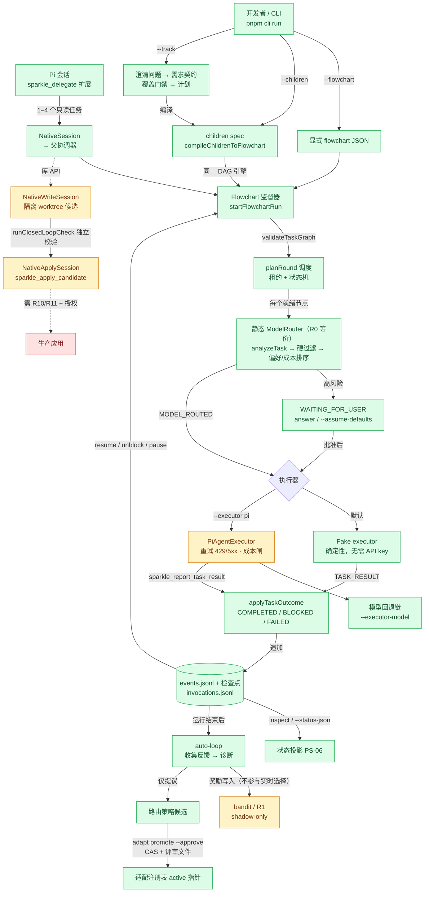
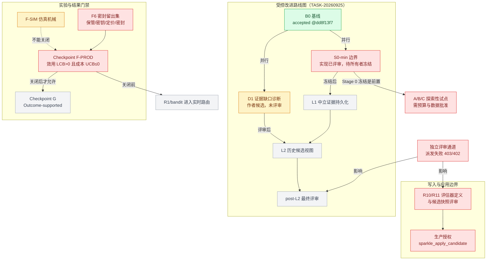

# pi-sparkle 架构总览与完成状态

> 快照初稿：2026-10-06 23:45（UTC+8）· 2026-10-07 校正 · 仓库 E:\Project\pi-sparkle · main @ `98af1b59`（0.1.0-preview.3，含 PR #59）

## 导语

Heidi，你好。pi-sparkle 是构建在 Pi（`@earendil-works/pi-agent-core` / `pi-ai` 0.86.1）之上的**项目开发多智能体运行时**：它把一个目标拆成 DAG 任务，交给父/子 agent 执行，把每一步写成 JSONL 事件与检查点，可暂停/恢复/解阻塞，并在运行后收集反馈、只以“提议”的方式改进路由策略。另有一个 Pi 原生扩展（`sparkle_delegate`），让 Pi 会话直接派发只读的侦察/评审子任务。

当前结论：**运行时主干（M0–M2.5）已完成并以 Developer Preview 0.1.0-preview.3 发布（仅源码、`private: true`、不发 npm）**；Pi 原生只读委派已完成；隔离写入与候选应用已接线但**未获生产授权**；自适应学习（R1/bandit）**按设计只在 shadow/离线运行**；受控改进路线图卡在 **S0-min 所有者冻结**，F6/F-PROD 留出集实验仍为**阻塞**。仓库里没有任何能力被标为 Outcome-supported。

本文所有数字和状态都标注了出处（commit / 工单 / 文件）。无法当场核实的内容标注 **UNVERIFIED**；不确定的一律按 Partial 处理并加注。

## 状态图例

| 状态 | 含义 |
|---|---|
| 🟢 Done | 已合并入 main，且有测试 / CI / 本地 gate 证据（多为作者验证；不等于独立验收或生产可用） |
| 🟠 Partial | 代码存在且部分接线/验证，但仍有明确缺口；或状态不确定 |
| ⚪ Planned | 已规划，尚未实现（或仅有计划文档） |
| 🔴 Blocked | 被人工决策、外部条件或上游门禁阻塞 |

## 当前快照

| 项目 | 事实 | 出处 |
|---|---|---|
| 版本 / 分支 | `0.1.0-preview.3`，main HEAD `98af1b59`（2026-10-07 00:07 UTC+8，PR #59 合并） | `package.json`；`git log` |
| 托管 CI | main 最近 4 次 CI 均 success；HEAD `98af1b59` 对应 run `37493204268` | 本次 `gh run list --branch main`（只读） |
| 全量测试（作者本地） | 3274 tests / 3255 pass / 0 fail / 19 skip + build（2026-10-07，main `98af1b59`） | 本次 `pnpm test` + `pnpm build`；lint/typecheck PASS。PR #59 托管 CI run `37493204268` PASS。 |
| 代码规模 | `src/` 下 272 个 `.ts` 文件 61,852 行；`test/` 下 371 个 `*.test.ts`；HEAD 可达 1,553 个提交 | 本次对 main `98af1b59` 工作树统计 |
| 发布 | Tag `v0.1.0-preview.3` + GitHub Pre-release 已创建；npm 发布不受支持 | `gh release list`；预览声明 |
| 工作区 | 存在未提交 WIP：`src/cli/main.ts`、`src/pi-adapter/pi-executor.ts` 及 2 个新测试、1 份计划（模型回退）；另有 10 个 worktree、2 个 stash | 本次 `git status` / `git worktree list` / `git stash list` |

模块/功能表统计（共 44 行）：🟢 Done 24，🟠 Partial 12，⚪ Planned 4，🔴 Blocked 4。

## 1. 端到端运行与数据流

- 三种入口（`--flowchart` / `--children` / `--track`）最终都落到同一个 flowchart DAG 引擎；Pi 原生的 `sparkle_delegate` 也复用父协调器（`src/native/session.ts`）。
- 实线 = 已在主干接线；虚线 = 库 API、WIP 或需授权的路径。颜色即完成状态（见图例）。
- bandit/R1 只接收运行后的奖励写入，`selectArm` 没有实时调用方（`docs/status-matrix.md` Adaptive library line，`live-isolation.test.ts` 约束）。

## 2. 路线图与门禁依赖

- 路线图唯一可派工顺序：`B0 → (D1 || S0-min) → L1 → L2 → final review`（`tasks/controlled-improvement-todo.md`）。
- F-SIM 的两臂效用按定义被同等观测，效用差恒为 0，不能用来关闭 F-PROD（`docs/status-matrix.md`）。
- F-PROD 退出标准与 Checkpoint G 前置关系来自 `docs/status-matrix.md` Policy gates 表与 ADR-005。

## 3. 模块 / 功能完成状态

| 领域 | 模块 / 功能 | 完成状态 | 证据 | 备注 |
|---|---|---|---|---|
| 运行时主干 | CLI `run` / `inspect` / `resume`（fake executor） | 🟢 Done | `src/cli/main.ts`；`docs/status-matrix.md` Runtime line；CI `cli-smoke`（Ubuntu/Windows） | 默认受支持路径；不是 Outcome-supported |
| 运行时主干 | `--flowchart` 流程图监督器（公共编排器） | 🟢 Done | `src/run/flowchart-run.ts`；status-matrix | BLOCKED 时给出 inspect/inject/unblock/note 四条路由 |
| 运行时主干 | `--children` 父/子协调 | 🟢 Done | `src/graph/compile-children.ts`、`src/run/child-coordinator.ts` | 普通 `--children` 记录 `skipContract: true`，不跑覆盖门禁 |
| 运行时主干 | `--track` 澄清 → 计划 → 执行 → 跟踪 | 🟢 Done | `src/track/loop.ts`；`src/requirement/coverage.ts` | 契约存在时由 `assertCoverageAllowsStart` 拦截 |
| 运行时主干 | DAG 校验 + 确定性调度 + 租约 | 🟢 Done | `src/graph/validate.ts`、`src/graph/readiness.ts`、`src/run/scheduler.ts` | 租约按设计不过期，由子协调器的超时约束工作量 |
| 运行时主干 | 事件日志 / 检查点 / 恢复 | 🟢 Done | `src/run/replay.ts`、`src/persist/jsonl.ts`、`src/run/crash-terminal.ts` | 截断尾行可恢复，中段损坏 fail-closed |
| 运行时主干 | Episode 绑定 / `inspect --episode` | 🟢 Done | `src/episode/*`、`src/run/episode-bind.ts` | reducer 对重复打开/悬空引用 fail-closed |
| 运行时主干 | PS-06 `inspect --run --status-json` 状态/恢复投影 | 🟢 Done | PR #54 合并 `dd9699b`；`src/run/projection.ts`；CI run `37465254859` | 独立评审未完成（派发 HTTP 403 无结论）；候选定位 / Web UI 属后续工作 |
| 运行时主干 | 隐私：`delete` 级联、`retain`（默认 90 天）、脱敏 | 🟢 Done | `src/privacy/*`、`src/feedback/redaction.ts`；P0 于 2026-08-26 技术复核关闭 | 隐私官会签“欢迎但不阻塞” |
| 运行时主干 | `doctor` / `pi-compat` / Pi pin 0.86.1 | 🟢 Done | status-matrix Pi compatibility line；`src/pi-compat/*` | 0.87.0 已发布但未适配（`tasks/todo.md` 2026-09-22 条目） |
| Pi 执行器 | 真实 Pi 执行器 `--executor pi` | 🟠 Partial | `src/pi-adapter/pi-executor.ts`；loopback HTTP/SSE 集成测试 | 真实供应商只有 opt-in `PI_SMOKE=1` 冒烟，未验证 |
| Pi 执行器 | 供应商重试（429/5xx） | 🟢 Done | `src/pi-adapter/provider-retry.ts`；`steer-retry` 集成测试 | 只在 `--executor pi` 路径生效 |
| Pi 执行器 | PS-HOTFIX 供应商失败归因 | 🟢 Done | `ed9a6e9`（经 PR #36 合并）；`docs/reports/2026-09-12-ps-hotfix-provider-failure-attribution.md` | 供应商失败 → `UNOBSERVED` + `PROVIDER_ERROR`，不再污染 bandit |
| Pi 执行器 | 模型回退链 + `--executor-model`（TASK-20261006-pi-executor-model-fallback） | 🟢 Done | PR #59 合并 main `98af1b59`；`src/cli/main.ts`、`src/pi-adapter/pi-executor.ts`、`test/unit/pi-adapter/executor-fallback.test.ts`、`test/unit/cli/resume-executor-config.test.ts` | 2026-10-07 focused 12/12、full suite/build、lint/typecheck、托管 CI PASS；独立评审/live-provider/生产授权仍开放 |
| sol-efficiency | PR-A harness-efficiency 离线分析器 | 🟢 Done | PR #36 合并 `6ee16a3`（2026-09-13 16:19 UTC+8）；`docs/reports/2026-09-13-sol-efficiency-delivery-status.md` | 源自 NVlabs/SoL-Pi 研究（`E:\Project\SoL-Pi-research`） |
| sol-efficiency | PR-B 运行级观察存储 + 离线投影 | 🟢 Done | PR #36；`src/context/observation-store.ts`、`observation-projection.ts` | 原生实时接线 2026-09-20 另行交付，默认关闭 |
| sol-efficiency | PS-P3 可信闭环（G2） | 🟠 Partial | `950b9ef`；`src/execution/closed-loop.ts`、`acceptance.ts` | 仅库 API + loopback，非默认 CLI；无真实 LLM |
| sol-efficiency | PS-P4 可信实验机械 | 🟠 Partial | `d84cfc0`；`src/experiments/*` | 不关闭 F-PROD，不声称 Week-1 密封 |
| sol-efficiency | PS-P5 效率（增量回放、事件聚合） | 🟢 Done | `4804d4c`；`src/run/incremental-replay.ts`、`event-aggregation.ts` | — |
| Pi 原生集成 | `sparkle_delegate` 只读委派 + `/sparkle-status` | 🟢 Done | `extensions/pi-sparkle/index.ts`、`src/native/session.ts`；独立评审 PASS @ `7d7cd59b`（`docs/reports/2026-09-25-integrated-review.md`） | worker 不能写文件/执行 shell；结果是子任务自报，非独立验收 |
| Pi 原生集成 | `NativeWriteSession` 隔离写入 | 🟠 Partial | `src/native/write-session.ts`；`docs/reports/2026-10-02-native-cancellation.md` | 仅库 API；worker 写工具未注册；自动写→应用链缺失 |
| Pi 原生集成 | `NativeApplySession` + `sparkle_apply_candidate` + 候选处置 | 🟠 Partial | `src/native/apply.ts`；PR #55；2026-10-06 O03 崩溃窗口回执对账 | 未获生产授权；R10/R11 未决；不声称完全崩溃原子 |
| 自适应 / 学习 | 静态 `ModelRouter`（R0 等价）实时路由 | 🟢 Done | `src/supervisor/model-router.ts`、`src/routing/live-selection.ts`、`analyze-task.ts` | 唯一实时选择路径 |
| 自适应 / 学习 | R1 / bandit / topology | 🟠 Partial | `src/routing/bandit.ts`、`r1.ts`、`topology.ts`；`live-isolation.test.ts` | 按设计只在 shadow/离线；F-PROD 前不得进入实时 |
| 自适应 / 学习 | auto-loop 收集 + 提议 | 🟢 Done | `src/learning/auto-loop.ts` | 从不自动晋升；`SPARKLE_AUTO_ADAPT=0` 只观察不学习 |
| 自适应 / 学习 | 晋升 CAS + 回滚 | 🟢 Done | `src/adaptation/promotion.ts`、`registry.ts`、`rollback.ts` | 唯一路径：`adapt promote --approve` 五个参数齐全 |
| 自适应 / 学习 | 强制上下文准入 + 分层任务诊断（PR #47） | 🟢 Done | 合并 `4df5baff` | 独立验收未完成 |
| 自适应 / 学习 | 命令证据溯源 C2-evidence-1（PR #48） | 🟢 Done | 合并 `b114255` | 无修订/变更集的命令结果一律 `UNOBSERVED` |
| 自适应 / 学习 | 证据失效分类 C2-evidence-2（PR #51） | 🟠 Partial | 合并 `cd47a753`；`src/evaluation/invalidation.ts` | 仅库，无运行时调用方，等待 B2 |
| 自适应 / 学习 | 项目学习键隔离（PS-02） | 🟢 Done | `docs/reports/2026-10-01-project-key-isolation.md` | 旧小写键目录不迁移，doctor 可见 |
| 路线图 | B0 基线 | 🟢 Done | accepted @ `dd8f13f7`（`docs/reports/2026-09-25-controlled-improvement-b0-verification.md`） | — |
| 路线图 | D1 证据缺口诊断 | 🟠 Partial | 作者候选 `8e7de99b`；`docs/reports/2026-09-25-native-evidence-gap-d1.md` | 独立任务验收未做 |
| 路线图 | S0-min 评估器/应用边界 | 🔴 Blocked | 实现 SPEC+QUALITY PASS @ `3f5711ba`；`docs/reports/2026-09-25-stage0-owner-freeze-package.md` | 等所有者冻结（决策 D1），L1 被它阻塞 |
| 路线图 | L1 / L2 / post-L2 最终评审 | ⚪ Planned | `tasks/controlled-improvement-todo.md` | 依赖 S0-min 冻结与 D1 评审 |
| 路线图 | 可靠性 O01–O11 | 🟠 Partial | `docs/reports/2026-09-27-reliability-implementation.md` | 多片已合并；全量 gate 曾被中断未计为通过；O07 堆/延迟测量 NOT RUN；O02 暂停在 stash；O12 延后 |
| 路线图 | PS-03 生命周期所有权（O02/O03） | 🟠 Partial | O03 处置/对账已合并（PR #55、#54）；`tasks/plan.md` | “由现有所有者负责”，所有者与剩余范围 UNVERIFIED |
| 路线图 | PS-04 root 预算（父/子成本结算） | ⚪ Planned | `docs/reports/2026-10-02-ps06-status-projection.md` 开放项 | 当前成本投影只是自身运行子集，不是账单 |
| 路线图 | PS-06 后续：候选定位 / Web UI | ⚪ Planned | 同上 | — |
| 门禁 | Checkpoint F-SIM | 🟠 Partial | status-matrix Adaptive library line | 仅仿真机械，不能关闭 F-PROD |
| 门禁 | F6 / Checkpoint F-PROD 密封留出集 | 🔴 Blocked | ADR-005；`docs/reports/2026-09-18-delivery-gate-unblock.md`；`tasks/todo.md` | 保管 100+15 材料、SM95 密钥元数据、定价绑定、runner 就绪、密封均未完成 |
| 门禁 | Checkpoint G Outcome-supported | ⚪ Planned | status-matrix Policy gates | F-PROD 关闭前禁止 |
| 门禁 | A/B/C 探索性试点 | 🔴 Blocked | `docs/reports/2026-09-21-ab-c-pilot-preregistration.md` | 需先冻结 + 所有者预算/数据批准（决策 D5） |
| 门禁 | 独立评审通道 | 🔴 Blocked | `tasks/todo.md`（402 配额、`UNOBSERVED`）；PR #54 评审包（HTTP 403） | 多处“独立验收未完成”都卡在这里（决策 D2） |
| 发布 | 0.1.0-preview.3 tag + GitHub Pre-release | 🟢 Done | `docs/reports/2026-10-06-preview-declaration.md`；`gh release list` | npm 发布按设计不支持 |

## 4. 关键算法（代码实际如何工作）

### 4.1 DAG 校验与确定性调度

文件：`src/graph/validate.ts`、`src/graph/readiness.ts`、`src/run/scheduler.ts`

- 启动前 `validateTaskGraph` 把任务集合校验成 DAG（防环），任何 worker 启动前就拒绝非法图。
- `computeReadyTasks` / `planRound`：取依赖全部 COMPLETED 或 SKIPPED 的 PENDING/READY 任务，按确定性拓扑序排序，截断到 `maxConcurrentTasks`，并排除已持有租约的任务。
- `LeaseRegistry` 是单进程互斥：每个任务至多一个活动租约，**租约不过期**（`expiresAt` 仅描述性）；恢复时 `runSupervisorRounds` 无条件回收重建的 RUNNING 租约。
- `applyTaskOutcome` 状态机：SUCCESS→COMPLETED；CANCELLED→CANCELLED；FAILURE/TIMEOUT→BLOCKED（attempt+1），耗尽后 FAILED；`applyRetry` 只允许 BLOCKED→READY。

### 4.2 实时模型路由（R0 等价静态策略）

文件：`src/supervisor/model-router.ts`、`src/routing/analyze-task.ts`、`src/routing/live-selection.ts`、`src/routing/policy.ts`

- `analyzeTask` 确定性分析：角色是最强信号，契约风险标志覆盖关键词；只有物理能力（如 vision）成为硬约束，“reasoning”关键词只提升复杂度。
- `partitionLiveCandidates` 用 `evaluateLiveCandidate` 对允许的目录模型做硬过滤（角色、复杂度、隐私、能力、上下文/输出、预算、截止、高风险），保留每条拒绝原因，不静默丢弃；无合格模型时抛 `RoutingRefusalError`。
- `compareLiveCandidates` 全序：偏好模型优先 → `estimatedCostUsd` 最低 → `id` 字典序；单遍取最小值，平局保留目录顺序。
- `effectiveConfidenceThreshold` 取所有阈值中最严格的；需要审批时状态变为 `WAITING_FOR_USER`，产出 `MODEL_ROUTED` 事件（含 eligibleModels、rejections、one-hot 行为分布）。

### 4.3 事件溯源、检查点与恢复

文件：`src/run/replay.ts`、`src/persist/jsonl.ts`、`src/run/crash-terminal.ts`、`src/run/flowchart-checkpoint.ts`

- 所有状态变化都追加到 `events.jsonl`；`replayRun` / `createReplayCursor` 重放事件重建运行，`materializeCheckpoint` / `validateCheckpoint` 处理持久检查点。
- 崩溃截断的最后一行被识别并忽略（stderr 警告），中段损坏 fail-closed。
- flowchart 恢复从日志中的 `TASK_REQUEST` 与检查点记录还原节点；`taskCriteria` 首写为准，缺失视为未知而非合成；成本上限只从本运行 `RUN_CREATED.limits` 恢复。
- 崩溃终态统一走 `crash-terminal.ts`（尽力写一次 `RUN_FAILED`，不覆盖）；`RUN_UNBLOCKED` 是 BLOCKED 区间的显式例外。

### 4.4 需求覆盖门禁

文件：`src/requirement/coverage.ts`

- `checkCoverageGate`：仅当（1）没有孤儿需求、（2）每条验收标准至少映射到一个任务、（3）每个澄清问题都有默认答案时才 `ok`。
- `assertCoverageAllowsStart` 在 `--track` 与带契约的库调用中拒绝启动；普通 `--children` 刻意不构造契约（`skipContract: true`）。

### 4.5 供应商重试与失败归因（含 PS-HOTFIX）

文件：`src/pi-adapter/provider-retry.ts`、`src/pi-adapter/pi-executor.ts`

- `classifyProviderFailure` 从抛出对象与扁平化错误文本中提取 HTTP 状态、`Retry-After`、`remedy_hint`，判断是否可重试；401/403 永不重试。
- `decideRetry` 默认策略（`DEFAULT_RETRY_POLICY`）：最多 3 次尝试，基准 500 ms 指数退避、上限 8 s、抖动 0.25；服务器要求的等待优先（remedy hint > Retry-After），超过 30 s 则放弃。
- PS-HOTFIX：执行器在没有 agent 结果时一律合成 `verification: UNOBSERVED`，并附 `failure.category: PROVIDER_ERROR`（FailureClass `provider`），因此供应商故障不会变成模型的确定性 FAIL 去污染 bandit/诊断/R1。

### 4.6 独立验收（闭环）

文件：`src/execution/acceptance.ts`、`src/execution/closed-loop.ts`、`src/execution/independent-check.ts`

- `evaluateIndependentAcceptance` fail-closed：必须有成功的独立命令检查并绑定产物；子任务自报（包括 PASSED + 空 evidenceIds）永远不够。
- G1A 额外要求命令/argv 一致、检查前后指纹一致。命令结果若缺少修订或变更集，C2-evidence-1 将其判为 `UNOBSERVED`（PR #48）。

### 4.7 运行后学习与提议式晋升

文件：`src/learning/auto-loop.ts`、`src/learning/signals.ts`、`src/learning/diagnostics.ts`、`src/routing/bandit.ts`、`src/adaptation/promotion.ts`、`src/adaptation/registry.ts`

- `runAutoAdaptLoop`：从事件与子运行收集用户 + 子 agent 信号 → 写反馈（先脱敏）→ `diagnoseModelProjectIssues` 按（模型，项目）归因 → 更新项目 bandit → 提议路由策略候选；从不 CAS 晋升。
- bandit 是 epsilon-greedy（明确“不是 UCB”），平均奖励最高者胜、按臂顺序打破平局；高风险任务从不探索；只有 `failureClass: model` 的 FAIL 进入后验。`selectArm` 没有实时调用方。
- Kill switch `SPARKLE_AUTO_ADAPT=0`：照常收集与诊断，但不更新 bandit、不提议。
- 晋升：注册表 active 指针只能经 CAS 变更（`--expected` 必须等于当前 active 版本），并要求 `--approve`、内容文件与持久化的独立评审出处；路由策略候选还要过评估报告断言。

### 4.8 原生候选应用与处置

文件：`src/native/apply.ts`、`src/native/write-session.ts`、`extensions/pi-sparkle/index.ts`

- 写入在保留的分离 worktree 候选中进行；主机冻结的命令/argv 在候选内由 `runClosedLoopCheck` 独立校验。
- 应用只接受已验收候选：源必须是干净、未变化的命名分支；realpath / 公共 Git 目录 / 注册信息不符的候选在校验前即拒绝；候选内再校验后，两棵树 checkout 再做受保护的 ref 更新，**不自动回滚**，部分/歧义失败保留候选与证据（`docs/status-matrix.md` Native candidate application 行）。
- 跨会话处置依赖运行级回执与签发的文件系统身份，幂等；2026-10-06 的崩溃窗口对账只覆盖精确授权的已不存在路径——明确不声称整条管线崩溃原子。
- 扩展只接受会话签发的不透明句柄，从不接受模型提供的命令参数（`IssuedCandidateHandle` 注释）。

## 5. 阻塞项

| 状态 | 阻塞 | 说明 | 出处 |
|---|---|---|---|
| 🔴 Blocked | 独立评审通道失效 | 评审派发多次失败：HTTP 403（PR #54）、402 配额、`UNOBSERVED` 无结论。PS-06、PR #47/#48/#51、2026-09-20 注册/路由/投影切片的独立验收都卡在这里。 | `docs/reports/2026-10-06-pr54-author-review-package.md`；`tasks/todo.md` |
| 🔴 Blocked | S0-min 未冻结 | 实现已通过 SPEC+QUALITY 评审，但所有者冻结未记录，L1 → L2 → 最终评审全部等待。 | `tasks/controlled-improvement-todo.md` |
| 🔴 Blocked | F6 / F-PROD 前置条件 | 100+15 材料保管、公开草稿污染裁定、SM95 密钥元数据、ESTIMATE 定价绑定、runner 就绪、密封均未完成；没有运行任何实验。 | `tasks/todo.md`；`docs/reports/2026-09-18-delivery-gate-unblock.md` |
| 🔴 Blocked | R10/R11 与生产应用授权 | `sparkle_apply_candidate` 已接线但非生产授权；评估器定义与候选快照评审未做。 | `docs/status-matrix.md` |
| 🟠 Partial | PR #36 证据请求 | SCM/xhh 原始的逐阶段独立 Reviewer PASS 证据请求仍未解决（GitHub reviews 数组为空）。 | `tasks/todo.md` |

## 6. 需要 Heidi 决策

- **D1 · 冻结 S0-min 边界**：需要产品所有者从 Stage 0 owner freeze package 中选定一个决策（DTO、来源/绑定/失败规则、规范化器）；这是解锁 L1 → L2 → 最终评审的前置。（出处：`docs/reports/2026-09-25-stage0-owner-freeze-package.md`）
- **D2 · 批准一条可用的独立评审通道**：指定评审者/模型/供应商（现有派发 403/402 失败）。决定是否接受“所有者委托集成”（PR #54 做法）作为过渡，或要求补做独立评审。（出处：PR #54 评审包；`tasks/todo.md`）
- **D3 · 原生应用：授权还是拒绝**：R10/R11 评审完成后，决定是否授权 `sparkle_apply_candidate` 用于生产，以及 worker 写工具与自动写→应用链是否继续保持缺失。（出处：`docs/status-matrix.md`；`tasks/todo.md`）
- **D4 · F6 去留**：推进保管/密钥/定价/密封，或继续搁置（parked）。在此之前不能声称任何自适应收益。（出处：ADR-005；`docs/reports/2026-09-04-f6-holdout-decision-package.md`）
- **D5 · A/B/C 试点预算与数据范围**：批准试点预算、数据传输范围、预注册阈值和产品定位；或明确暂不试点。（出处：`docs/reports/2026-09-21-ab-c-pilot-preregistration.md`）
- **D6 · 执行器模型回退语义**：PR #59 已合并；当前调用记录标注实际模型与结果，但默认 fast-model 回退仍缺显式 opt-in/同意语义与独立评审。（出处：`docs/status-matrix.md`；PR #59 计划）
- **D7 · Pi 0.87 升级**：保持已验证的 0.86.1 pin，或批准单独的 0.87 适配计划。（出处：`tasks/todo.md`（2026-09-22 Pi self-review 条目））
- **D8 · 清理保留的分支 / worktree / stash**：8 个有冲突的保留分支、10 个 worktree、2 个 stash 仍在本地；决定保留、对账还是归档。（出处：`docs/reports/2026-09-29-sync-cleanup.md`；本次 `git worktree list`）
- **D9 已处理（2026-10-07）**：`docs/reports/2026-10-06-preview-declaration.md` 已用带日期的 correction 记录 `0.1.0-preview.2` GitHub Release 已创建；本项不再阻塞。

## 7. 尚未完成

- 真实供应商端到端验证（目前只有 loopback 与 opt-in 冒烟）。
- R1/bandit/topology 进入实时路由（F-PROD 关闭前禁止）。
- Checkpoint F-PROD 与 Outcome-supported：仓库中没有任何能力被标为 Outcome-supported。
- 受控改进 L1、L2、post-L2 最终评审；D1 独立验收。
- PS-04 父/子 root 预算结算；PS-06 候选定位与 Web UI；PS-03 剩余范围（所有者 UNVERIFIED）。
- 原生 worker 写工具注册、自动写→应用链、生产应用授权、完整崩溃原子性。
- 证据失效（C2-evidence-2）的运行时接线（等待 B2）。
- 可靠性 O01–O11 整体验收、O07 堆/延迟测量、O02 收尾；O12 延后。
- 执行器模型回退的显式 opt-in/同意语义、独立评审与 live-provider 验证。
- npm 发布：按设计不支持（`private: true`，仅 clone + pnpm）。

## 8. 来源与核验方式

- 仓库：`E:\Project\pi-sparkle`，remote `https://github.com/Xhhemoing/pi-sparkle.git`；只读 `git log/branch/status/worktree/stash`，`gh run list`、`gh pr list`（无开放 PR）、`gh release list`。
- 权威状态：`docs/status-matrix.md`、`tasks/plan.md`、`tasks/todo.md`、`tasks/controlled-improvement-todo.md`、`docs/reports/2026-10-06-preview-declaration.md`、`CHANGELOG.md`、`.github/workflows/ci.yml`。
- 源码：本文“关键算法”一节逐条列出的文件（main `b7a59389` 工作树，2026-10-07 校正时干净）。
- `C:\Users\86080\.agent_workspace\pi-sparkle` 只有 `runtime/` 与 `adaptation/` 运行时状态目录，不是代码副本。
- `E:\Project\SoL-Pi-research` 是 `NVlabs/SoL-Pi` 的克隆（Action Fusion / ObservationPack / Evidence-Preserving Reducer / Online Context Compact），是 sol-efficiency 工作线的参考来源。
- Notion（搜索 “pi-sparkle”）：没有找到相关计划/状态页面。

### UNVERIFIED（本次无法确认）

- 2026-10-07 作者本地重跑 full suite/build；托管 CI 本条 commit 正在执行，结论未当场确认。`pnpm prerelease` 未重跑。
- “Sparkle Implementer seat”这一角色在仓库中没有找到对应记录。
- PS-03 的当前所有者与剩余范围。
- 已消除：执行器模型回退 focused/full test、typecheck/build、托管 CI 均通过；独立评审与 live-provider 仍开放。
- 2026-10-07 附加归档：两个含未提交改动的 worktree（\0-reconstruction-check\ 34 文件、\stage0-20260924\ 4 文件）与两个 stash patch 已复制到 \.agent_workspace/archive/worktrees-20261007/\，哈希核对 0 mismatch；原始 worktree 与 stash 保留。\
elease/preview3-prep-20261006\ 是遗留别名，指向已合并提交且无独有变更，已删除。
