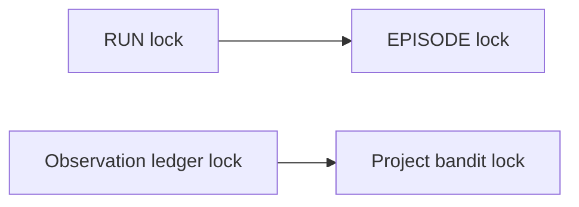

# Controlled improvement B0 baseline and lock graph

## Identity

- Task: `B0` under `TASK-20260925-controlled-improvement-roadmap`
- Date: 2026-09-25
- Owner: coordinator
- State: ready-for-review
- Historical pre-capture Git base: `8b0a495de8e3203f64a7ca7f9d9693d6c71e23c3`
- Historical superseded combined author-run candidate: `9b9fbeecdddae85e0454c9d99a13b2f3617a3a51` on `codex/controlled-improvement-20260925`
- Corrected integrated implementation candidate: `8e7de99b3d3b196e3b23807d52e4f6b8b59d57dc`
- Current clean coordination head: `07c988699fdefd7288564b14b146fff2945f8b23`
- Isolated B0 branch/worktree: `codex/controlled-improvement-b0-20260925` / `.agent_workspace/worktrees/controlled-improvement-b0-20260925`

## Scope and non-goals

B0 records both the historical dirty capture and the exact committed candidate that later replaced it, freezes pairwise-disjoint ownership for the corrected MVP, inventories current cooperative locks, and identifies the existing canonical JSON symbol that S0-min must resolve. It does not accept the combined author-run changes, freeze Stage 0, add a global lifecycle lock, accept D1/L1/L2, or integrate the superseded N1/N3 storage branches.

The earlier N3 candidate remains isolated at `3b42217420c0b8f2cba2ac22e214d8a882e164a5`. It is not integrated because the controlling checklist explicitly defers N3.

## Reproducible implementation baseline

The last pre-commit dirty capture is:

`E:/Project/pi-sparkle/.agent_workspace/controlled-improvement-b0-20260925/baseline-v3/`

It contains `baseline-status.txt`, `tracked-files.txt`, `untracked-files.txt`, `snapshot/`, `current-original-tree-comparison.txt`, and `reconstruction-result.txt`. The snapshot preserves byte copies of 24 modified tracked files and 10 untracked files. Its reconstruction check reported `byteExact=True files=34`.

After that capture, another execution chain advanced the original branch to clean commit `9b9fbeecdddae85e0454c9d99a13b2f3617a3a51` (`feat: harden controlled improvement path`). The handoff record for that earlier clean candidate was:

`E:/Project/pi-sparkle/.agent_workspace/controlled-improvement-b0-20260925/baseline-v4/`

It records the exact base/head identity, clean status, the 34 paths changed by the commit, byte copies of those 34 candidate files, commit statistics, and toolchain versions. Fresh comparison reported `deltaPathSetExact=True`, `deltaByteExact=True`, and `mismatchCount=0`. The complete implementation tree is reproducible from the exact commit; the delta snapshot preserves the working-tree bytes that were reviewed during B0.

Commit `9b9fbeec` includes the D1 author candidate plus unrelated native/projection/readonly-evaluator candidate bytes. It is not B0, D1, or S0-min acceptance evidence. `baseline-v3` remains historical evidence of the pre-commit dirty state and must not be described as the live original-tree state.

The first exact-SHA quality review found that `9b9fbeec` also committed contradictory task wording that called B0, D1, and a readonly-manifest candidate complete. Commit `1b5e1d8dcb26aa66707035ea7f71e477456909ef` corrects `tasks/todo.md` and the combined implementation report: no B0/D1/S0-min acceptance is claimed, the readonly manifest is explicitly pre-S0 evidence, and the controlling sequence remains `B0 → (D1 review || S0-min freeze) → L1 → L2 → final review`.

After that status-only correction, another author chain continued writing the original working tree. `baseline-v5`, `baseline-v6`, and `baseline-v7` preserve the successive dirty states. The 15-file `baseline-v7` capture became commit `8e7de99b3d3b196e3b23807d52e4f6b8b59d57dc` with report/status updates. Later coordination-only commits reconciled task states, recorded the independent current-slice review and Stage 0 owner package, added reviewer provenance, and bound the provenance-bearing record, ending at clean coordination head `07c988699fdefd7288564b14b146fff2945f8b23`.

The current authoritative handoff record is:

`E:/Project/pi-sparkle/.agent_workspace/controlled-improvement-b0-20260925/baseline-v9/`

`baseline-v9` records base `1b5e1d8d`, implementation candidate `8e7de99b`, coordination head `07c98869`, and the exact 25 changed paths. The current original worktree is clean. Capture verification reported `files=25`, `pathSetExact=True`, `byteExact=True`, and `mismatchCount=0`. The additional coordination records include the independent current-slice PASS provenance and the Stage 0 owner decision package; neither record accepts B0 or D1.

Of the 15 code/test paths in `8e7de99b`, six belong to the bounded D1 candidate: `src/persist/jsonl.ts`, `src/run/event-store.ts`, `src/run/inspection.ts`, `test/unit/persist/jsonl-offset.test.ts`, `test/unit/run/event-store.test.ts`, and `test/unit/run/inspection.test.ts`. The other nine files modify native bridge, projection privacy, or worker-read contracts and remain outside both D1 and S0-min leases; they must not be pulled into D1 review without a separate lease and review package. Neither the author-run gate nor these commits accept D1 or S0-min.

## Existing lock graph

The common primitive is `withExclusiveFileLock` in `src/persist/file-lock.ts`; it is cooperative, cross-process, fail-closed on timeout, and not re-entrant.

Only two current edges are proven nested lock acquisitions:

Other operations are sequencing edges and must not be promoted into a global order:

- run deletion: invocation rewrite, release; run lock, release; dataset path revalidation/removal;
- episode deletion: feedback cascade, release; episode lock, release; residual scan;
- auto-loop: feedback appends; ledger→bandit; registry update;
- runtime invocation sinks may overlap a held run lock, but are asynchronous and not a required nested transaction.

Lock identities and principal owners:

| Lock | Path/helper | Current scope |
|---|---|---|
| RUN | `runLockPath` in `src/run/event-store.ts` | run/flowchart/supervisor lifecycle, pause, run deletion, loop artifacts |
| EPISODE | `episodeLockPath` in `src/run/episode-bind.ts` | run settlement, CLI close, episode deletion |
| FEEDBACK | `feedbackLogLockPath` in `src/feedback/store.ts` | append and episode deletion cascade |
| INVOCATION | `invocationLogLockPath` in `src/telemetry/invocation-log.ts` | append and run deletion rewrite |
| REGISTRY | `withAdaptationRegistryLock` in `src/adaptation/promotion.ts` | load/mutate/save promotion and proposal transactions |
| LEDGER/BANDIT | observation-ledger then bandit-store locks | learning observation update |
| OBSERVATION | `observationLockPath` in `src/context/observation-store.ts` | per-run observation append/rewrite; separate from the RUN lock |
| PREFERENCE | `preferenceSnapshotLockPath` in `src/preferences/store.ts`, acquired by `src/cli/pref.ts` | preference snapshot read/change/write transaction |
| CREDENTIAL | `<credential-file>.lock` in `src/pi-adapter/file-credential-store.ts` | credential file set/delete and owner-only permission repair |

The OBSERVATION, PREFERENCE, and CREDENTIAL locks have no proven nested edge with the two lock-order edges above in the inspected production paths. They remain independent nodes, not authorization to introduce new cross-lock transactions.

Known races remain explicit and are not repaired by B0:

1. a late invocation can land after run deletion's invocation rewrite;
2. feedback/outcome can arrive after episode deletion's feedback cascade;
3. feedback readers can observe records and tombstones from different instants;
4. evaluation dataset export/delete relies on path identity revalidation rather than one cooperative transaction.

No later task may add a global lifecycle long lock from this record. A new lock requires a concrete failing race, a reviewed transaction design, and a deterministic race test.

## Canonical JSON and Stage 0 boundary

The only existing general canonical JSON symbol is `src/experiments/manifest.ts::stableStringify`; existing experiment, replay, observation-ledger, and readonly-manifest code reuses that symbol or wrappers around it.

This is an identity/location finding, not a Stage 0 freeze. The current Stage 0 draft requires one pinned RFC 8785 JCS dependency and forbids a handwritten fallback, while `stableStringify` is handwritten and no direct JCS dependency is pinned. Therefore:

- S0-min owns the decision to amend the draft to accept and constrain this symbol, or replace/migrate this one symbol to a pinned JCS implementation;
- it must not create a second canonicalizer;
- the committed author candidate in `src/experiments/readonly-evaluator-manifest.ts` and its fixtures is not freeze evidence;
- L1 remains blocked until the responsible owner and fresh reviewer return an actual S0-min PASS.

The closest neutral terminal outcome type is `src/evaluation/types.ts::EvaluationRecord`, but no frozen host producer/store exists. Existing `FeedbackRecord` persistence has a permissive parser and auto-loop authorship, so it cannot be reclassified as trusted host outcome evidence. The owner package in `docs/reports/2026-09-25-stage0-owner-freeze-package.md` is `ready-for-owner-review`; it recommends project deterministic JSON v1 as Option A but explicitly remains not approved and not frozen.

## Frozen disjoint leases

| Task | Exclusive files | State/condition |
|---|---|---|
| D1 | `src/persist/jsonl.ts`; `src/run/event-store.ts`; `src/run/inspection.ts`; `src/cli/main.ts`; `test/unit/run/event-store.test.ts`; `test/unit/run/inspection.test.ts`; `docs/superpowers/plans/2026-09-25-native-observation-diagnosis.md`; `docs/reports/2026-09-25-native-evidence-gap-d1.md`; test-only follow-up `test/unit/persist/jsonl-offset.test.ts` | review the exact D1 file subset from clean implementation commit `8e7de99b` in an isolated worktree after B0 acceptance; exclude the nine lease-external native/projection/worker files |
| S0-min | `docs/superpowers/specs/2026-09-21-evaluator-boundary-freeze.md`; `docs/reports/2026-09-25-stage0-min-freeze.md`; `src/evaluation/types.ts`; `src/evaluation/evaluator.ts`; `test/unit/evaluation/evaluation-identity.test.ts`; `src/domain/canonical-json.ts`; `test/unit/domain/canonical-json.test.ts`; `src/experiments/manifest.ts`; `test/unit/experiments/freeze.test.ts`; `test/unit/experiments/task-spec.test.ts` | may start after B0 acceptance; pre-existing Stage 0 and readonly-manifest candidate bytes outside this lease require explicit owner release or reconciliation |
| L1 | `src/feedback/types.ts`; `src/feedback/store.ts`; `test/unit/feedback/store.test.ts`; `test/unit/feedback/store-lock.test.ts` | design may wait; acceptance and wiring require S0-min PASS |
| L2 | `src/learning/historical-candidate-view.ts`; `test/unit/learning/historical-candidate-view.test.ts`; `test/integration/learning/historical-candidate-privacy.test.ts` | requires accepted D1 and L1; no auto-loop/registry/promotion/routing writes |

Any privacy deletion or record-class change requires a coordinator lease amendment after checking the lock graph; it is not implicitly granted to L1.

## Acceptance evidence

- Implementation baseline: clean exact candidate `9b9fbeec`; its 34-file delta from `8b0a495d` is path-exact and 34/34 working-tree bytes match `baseline-v4`.
- Contract reconciliation: `1b5e1d8d` removes the false B0/D1/S0 completion claims and explicitly classifies the readonly manifest as pre-S0 evidence.
- Current clean baseline: baseline-v9 captures all 25 paths from `1b5e1d8d` to `07c98869` path-exact and byte-exact; six code/test paths are classified for D1, nine are explicitly lease-external, and ten are report/status/review reconciliation.
- Lock graph: two proven nested edges; sequencing edges and four residual races recorded.
- Canonicalizer identity: exact current symbol named; S0-min conflict and unblock condition recorded.
- File ownership: D1, S0-min, L1, and L2 leases are pairwise path-disjoint. D1 intentionally owns the eight captured author-candidate paths; S0-min, L1, and L2 do not overlap baseline-v3 dirty paths.
- Integrated current-slice review: independent reviewer `/root/integrated_slice_verify` returned PASS for reviewed revision `7d7cd59bb313f53c605d6e9988be910bfe5e3ec8`, with 90 focused tests, typecheck, workflow check, and diff checks; see [the integrated review](2026-09-25-integrated-review.md). That verdict covers the corrected current slice only; B0 and D1 task acceptance remain open, and it is not the post-L2 final review.
- Stage 0 owner package: `ready-for-owner-review`, not approved and not frozen; it does not unblock L1.
- Product tests: not run for this documentation-only B0 slice.
- Required checks before acceptance: `pnpm workflow:check`, `git diff --check`, independent specification review followed by independent quality review.

## Open gates and handoff

Stage 0, the trusted host outcome producer, D1 acceptance, L1, L2, real provider/host execution, R10/R11, F6, benefit claims, promotion, apply, migration, release, and production actions remain open. After B0 independent acceptance, the exact D1 subset from `8e7de99b` may enter isolated review while S0-min begins in parallel. The nine lease-external files stay outside D1 ownership. L1 remains blocked on S0-min; L2 remains blocked on accepted D1 and L1.
