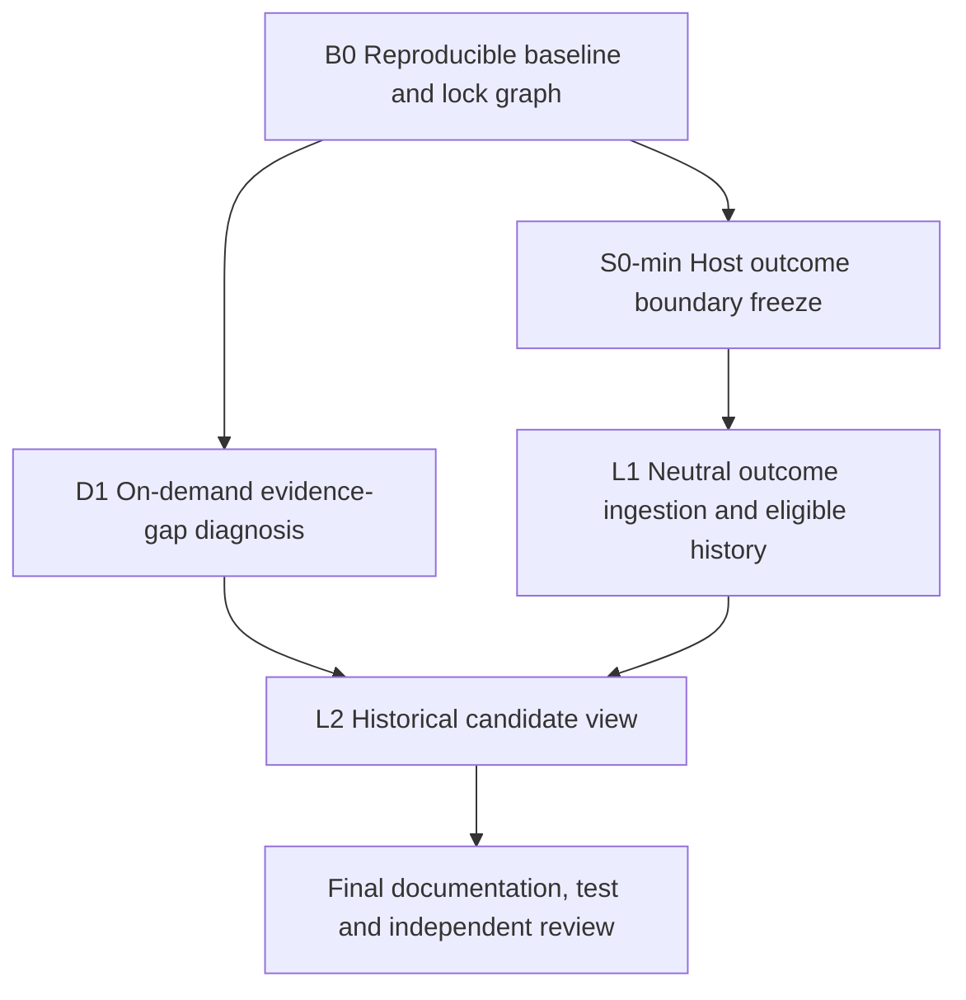
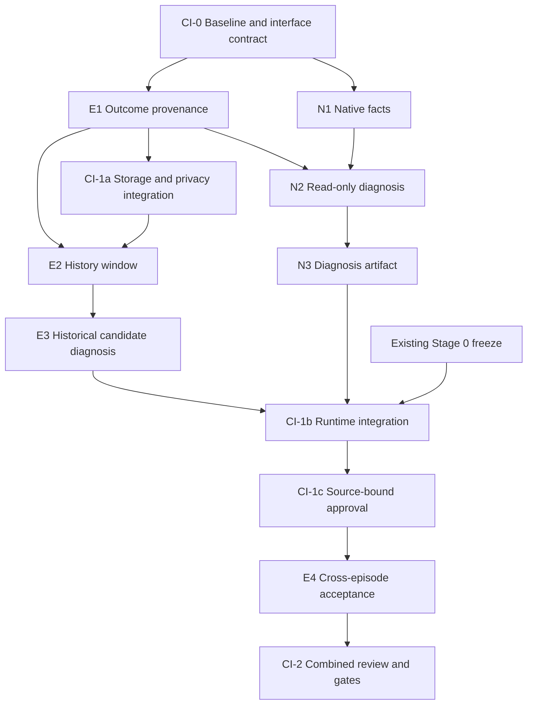

# Pi-first Controlled Improvement Implementation Plan

> **For agentic workers:** REQUIRED SUB-SKILL: Use superpowers:subagent-driven-development (recommended) or superpowers:executing-plans to implement this plan task-by-task. Steps use checkbox (`- [ ]`) syntax for tracking.

**Goal:** 先交付一个只读、可审查的基础切片：按需识别证据缺口，摄取冻结的中立宿主结果，并生成跨 episode 的 candidate-only 历史视图；激活与正式 promotion 延期。

**Architecture:** B0 先固定可重建基线、lease、lock graph 与 canonicalizer；D1 和 S0-min 并行；L1 只消费 S0-min 冻结的 neutral evaluation/feedback DTO；L2 合并历史窗口和诊断为 candidate-only view。当前切片不新增诊断存储、全局生命周期长锁、批准入口或路由激活。

**Tech Stack:** TypeScript、Node.js `>=22.19.0`、`pnpm@10.17.1`、`node:test`、现有 EventStore/run inspection 与 evaluation/feedback persistence。

## 2026-09-25 independent review correction (controlling)

本节记录同日独立审查的 **REQUEST CHANGES**、修复和 current-slice 独立 **PASS**。它取代本文件后续保留的 pre-review CI/E/N DAG 与 MVP 范围；后续旧段落仅用于说明草案如何形成，不能作为派工依据。B0 与 D1 已形成作者候选，但其任务级接受仍开放；S0-min 决策包为 `ready-for-owner-review`，L1/L2 仍为 `planned`，Stage 0 未批准、未冻结。

### Corrected MVP and critical path



- **B0** preserves the dirty baseline, freezes file ownership, inventories existing locks, and writes a lock-order graph before any persistence change. It also identifies the exact Stage 0 canonicalizer that later stages must reuse; no second canonical JSON implementation may be introduced.
- **D1** reuses the existing `EventStore` and `src/run/inspection.ts` query path to compute `evidence-gap` on demand. It adds no N1 fact store, N3 diagnosis artifact store, background consumer, unblock action, retry, model call, or model-blame signal.
- **S0-min** is the minimum Stage 0 freeze needed by evidence learning: a host-owned terminal outcome DTO, trusted binding/source rules, failure attribution, and the one canonicalizer used for exact canonical JSON. It is a hard dependency of E1's successor **L1**; fixtures may shape tests before the freeze, but L1 cannot be accepted or wired without it.
- **L1** persists/reads the host outcome through a neutral evaluation/feedback schema owned outside `src/learning/`. Learning code consumes that schema and does not define the persisted host DTO. Existing bounded store and deletion semantics are reused; any required change follows the B0 lock graph and uses short existing lock scopes.
- **L2** merges the former E2 history-window and E3 historical-diagnosis work into one `historical-candidate-view` that reconstructs eligible compatible history and emits candidate-only inspection output. It cannot alter active policy, registry promotion state, leases, routing, or current execution.
- **Final review** is the future post-L2 review. The corrected current slice already has an independent PASS, but that verdict does not satisfy the post-L2 review or any owner freeze.

### MVP removals and deferrals

- Former N1 and N3 are removed from the MVP. Their proposed new native-fact and diagnosis-artifact storage must not be implemented for D1.
- Former CI-1c source-bound approval, E4 activation/cross-episode apply scenario, and formal promotion are deferred to a later separately reviewed plan. No approval fixture may be presented as MVP acceptance.
- Former E2 and E3 are not separate dispatches; L2 owns their candidate-view-only behavior and tests.
- No global learning-source lifecycle long lock is introduced. B0 must first document the actual run/event/feedback/deletion/registry lock graph and identify a concrete race that existing locks plus fail-closed revalidation cannot handle. Any later new lock needs its own reviewed transaction design and deterministic race test.
- R10/R11 and F6 remain independent gates. R10/R11 continues to govern apply/write authorization; F6 remains parked for its own holdout/governance work. Neither is silently folded into L1/L2, and completing this MVP closes neither gate.

### Corrected dispatch summary

| Task | Depends on | Deliverable | State |
|---|---|---|---|
| B0 | none | reproducible baseline, ownership leases, current lock graph, Stage 0 canonicalizer location | ready-for-review |
| D1 | B0 | on-demand `EventStore`/inspection evidence-gap, read-only and non-persistent | author-candidate-unreviewed |
| S0-min | B0 | owner decision package for neutral host outcome DTO/source/failure/canonicalization contract; package itself freezes nothing | ready-for-owner-review |
| L1 | S0-min | neutral evaluation/feedback persistence and bounded eligible-history reader | planned |
| L2 | D1, L1 | candidate-only historical view; no activation or promotion | planned |
| final review | L2 | focused/gate evidence plus fresh independent verdict | planned |

## Superseded pre-review draft retained for provenance

The remaining sections below preserve the earlier same-day draft. Where they mention CI-0/CI-1a/CI-1b/CI-1c/CI-2, E1-E4, N1-N3, lifecycle-wide locking, approval, activation, promotion, or a previous planning PASS, the controlling correction above and the dated planning report take precedence.

## Global Constraints

- 本轮交付是规划文档，不是产品实现或实验批准。新增任务均为 `planned`；不能从文档完成推断代码完成。
- shell 使用 `pwsh`；脚本首行 `$ErrorActionPreference = 'Stop'`；文本读写明确 `-Encoding UTF8`。
- 遵守 [ADR-004](../../decisions/0004-controlled-adaptation.md)、[ADR-006](../../decisions/0006-pi-extension-reverse-adapter.md)、[ADR-008](../../decisions/0008-remove-sha256.md)。没有替代密码学散列；opaque IDs/exact bytes 仅提供 local-weak 绑定，不声称抗本地篡改。
- 保留已有脏工作区、既有批准快照、隐私删除与 kill switch。不得凭 agent 自报补 independent evidence。
- 不自动晋升，不改已租赁/已记录决策，不把候选注入当前执行，不接 live bandit/R1/topology，不注册 worker-write，不自动 write→apply；F6 保持 parked。
- 不调用真实 provider、迁移旧数据、发布、生产 apply 或放行预算/数据传输。后续执行相应动作须满足已定义的专门门禁。
- 冻结 CLI/event/JSON 表面同时审实现与 pinning tests；不借新诊断改变旧字段含义。

## Identity and authority

- ID: `TASK-20260925-controlled-improvement-roadmap`；Owner: coordinator；State: `planned`；Date: 2026-09-25。
- 用户决定：“直接自主分析……做出来支持多agent共同编写推进的具体计划”。据此自主选择本规划的默认方向与协作方式，不再以定位选择题阻塞文档交付。
- 调查基线：`f15a3b81d6ff8b2e1b67ac0f26ca5bc7937455bb` 加当前未提交更改。它不是未来实现的验收 revision。
- 权威顺序沿用 [development workflow](../../development-workflow.md)：accepted ADR/spec → [status matrix](../../status-matrix.md) → active tasks → dated reports。
- 工作入口：[专用 checklist](../../../tasks/controlled-improvement-todo.md)；子包 [E：可信结果与历史学习](2026-09-25-evidence-learning-foundation.md)、[N：原生观测与诊断](2026-09-25-native-observation-diagnosis.md)；[本次规划证据与记录纠偏](../../reports/2026-09-25-controlled-improvement-planning.md)。

## Strategic decision and non-goals

**规划主线：Pi-first 的受控持续改进。可信证据与变更控制是实现该目标的基础。** 先在一个真实工作流中证明“以前出现过的问题，能通过可追溯的候选与评价减少再次发生”，再扩展适配器和改进对象。这是当前执行规划选择，不擅自变更 accepted ADR，也不宣称市场定位已被验证。

当前不优先投入：通用 IDE/UI 功能追平、多宿主兼容矩阵、企业商业包装、训练/BKT、全自动风险记忆和在线自适应。第二宿主必须有一个明确使用者、同一契约下可复跑的目标任务和可承受的维护成本，才进入独立接入计划。

首个切片选择两个相互支持但验收分离的目标：

1. 原生委派宣称完成而缺少宿主独立验收时，给出有来源的 `evidence-gap` 诊断；不把这一事实归罪于模型，也不解除阻塞。
2. 同项目、兼容版本、至少两个 episode 的独立结果可以累积达到原有五样本阈值，只产生路由候选；离线批准 fixture 后，新运行可读取已批准策略，已租赁/已记录决策不变；resume尚未租赁节点沿用既有读取当前active策略的规则。

它们证明诊断和学习的连接能力，不证明真实模型质量提高。后者需要后续单独预注册的可比任务实验，不能由投影 A/B/C pilot 冒充。

## Verified baseline and why this order

| 已核对事实 | 对规划的约束 |
|---|---|
| NativeSession 只观察显式 1–4 个 scout/reviewer 委派；结果 `independentVerification=UNOBSERVED` | N 包先做显式任务观测；不收普通宿主会话或原始对话 |
| auto-loop 持久化状态，但 diagnose 主要消费本次 signals；合成 4+4 没候选，单批 5 有候选 | 先补合格历史窗口；不能把阈值改成 4 作为解决方案 |
| 当前 ExecutionEvent 有 tool start/end、isError、终态，没有可信 exitCode/授权事实字段 | 不从 summary 猜退出码、凭据故障或许可状态 |
| ANALYSIS_QUEUED 是阻塞原因，当前没有自动分析消费/解阻塞 | 新消费者只产诊断 artifact；执行恢复仍遵循既有控制面 |
| 当前 native executor 实际绑定一个宿主模型；auto-loop 排除 primary model 的失败候选 | 当前原生链先兑现诊断；不能承诺它自然产生非 primary 路由候选 |
| live routing 读取 approved registry snapshot；bandit 不负责实时选择 | 新历史路径保持 candidate-only，不绕过 F-PROD |
| 隔离写入/独立命令检查/保留候选/apply 有本地测试；worker-write 未注册 | 复用已有能力，生产 apply 与未来写入口继续走 R10/R11 |
| 工作区已有模型支持检查、投影 hardening 和 manifest validator 修改 | CI-0 先固定可重建基线；不能丢弃、重复实现或误认它们已经独立验收 |

路由生效边界按现有 `test/unit/run/flowchart-learned-routing.test.ts` 保持：已租赁节点不改，resume的未租赁节点可读取当前已批准策略。本计划不引入整run冻结；candidate-only与active-policy必须分开。

2026-09-25 调查中的 52+39 个离线测试和合成探针结果见规划报告。该证据只说明调查时的行为，不替代后续实现 gate。

## Milestones and exit criteria

不承诺凭空估计的日历工期；按可独立审查的批次推进。每批都有停止条件，未达标不继续扩大范围。

| 里程碑 | 进入条件 / 工作 | 退出证据 | 不得推导的结论 |
|---|---|---|---|
| M0 可并行开发基线 | CI-0；保全 dirty tree、接口/文件 lease、任务 DAG | 可复建 base revision、逐任务 ownership、未决 gate 清单 | 当前未提交更改均已获批准 |
| M1 可信离线组件 | E1、N1、CI-1a、E2、E3、N2、N3 | 拒绝伪造来源、窗口去重/隔离/删除、确定性诊断的 focused tests | 获得真实 independent outcome |
| M2 首个可追溯机制闭环 | CI-1b、CI-1c、E4、CI-2；真实宿主接线另受 Stage 0 约束 | 4+4 candidate-only、审批 fixture、已租赁决策不变/新租赁读取已批准策略、native diagnostic artifact、fresh reviews + gates | 已改善实际质量或打开 live adaptation |
| M3 一种有实测收益的读工作流 | 既有 evidence-first 门禁逐个完成 | 冻结 Stage 0 → hardening/telemetry → evaluator manifest → 获准 A/B/C pilot 的账本/报告 | 投影收益等同学习收益、write 安全或 F6 |
| M4 一种有实测收益的受控改进 | M2、可信 evaluator、代表性失败族、独立新预注册/预算 | 可比后续任务中候选前后差异、成本/失败/人工纠正同时报告、明确适用范围 | 广泛自学习或自动生产应用 |
| M5 有条件扩大能力 | M3/M4 可复现且新增需求明确 | 每增加一个改进对象/宿主/写入口都有单独契约、回滚与验收包 | 所有后续方向同时启动 |

M4 还有一个数据可达性前置：保留 primary-model exclusion 的情况下，当前单模型 native executor 无法自然提供非 primary 模型的路由候选。先由单独切片证明实际多模型执行/授权/计费归属，再选定能产生合格样本的真实只读任务；或另立 prompt/workflow 候选契约并独立验收。不能降低归因要求来凑出闭环。M2 的跨 episode 路由验收明确只是离线机制证据。

M4 的设计须冻结任务族、baseline/candidate 版本、训练与评价数据隔离、评价者与失败归因、主要指标/停止阈值、缺失数据规则。样本量由先验或探索数据和目标效应决定，本规划不编造一个足够证明收益的数量。F6/F-PROD 所覆盖的运行仍必须等其原门禁；静态批准快照的机制测试不豁免它。

## Dependency graph and parallel waves



Stage 0 箭头限制 CI-1b 的真实宿主可信结果接线；Stage 0 未冻时，E/N 纯组件、CI-1a 存储/隐私测试和 fake host 集成 fixture 可继续。CI-1b 必须记录 `offline exercised / real-host blocked`，不得把 fixture 接线声称真实来源已可信。

| 波次 | Evidence builder | Native builder | Coordinator / reviewer |
|---|---|---|---|
| 0 | 阅读 E 包并核对接口 | 阅读 N 包并核对可观察事实 | CI-0；一位 reviewer 审依赖/接口 |
| 1 | E1 | N1 | review 两包；不写它们的 lease 文件 |
| 2 | E2 纯函数起步；待 CI-1a 后验收存储路径 | N2（须 E1 interface reviewed） | CI-1a，随后独立 reviewer 检查隐私竞争 |
| 3 | E3 | N3 | review 组件，排队 CI-1b shared patch |
| 4 | E4（CI-1b + CI-1c 集成头上） | 只读复核 native integration | CI-1b → CI-1c → CI-2，spec/quality 两阶段审查 |

每个 builder 完成后让出执行槽；最多 coordinator + 2 builders + 1 fresh reviewer。分支可并行，合并队列串行。整个 CI-1a/CI-1b/CI-1c 由同一 coordinator 角色写共享文件，避免存储与原生包各改一次 auto-loop。

## CI-0: preserve baseline and freeze dispatch contracts

**Owner:** coordinator。**Depends:** 无。**Allowed files:** `tasks/controlled-improvement-todo.md`、本计划、两个子计划的协调修订（须原作者释放 lease）、dated `docs/reports/`。产品代码只读。

- [ ] 读 AGENTS、active plan/checklist、相关 ADR/status、已有 diff；将 `git status --short`、`git rev-parse HEAD`、`git diff --name-status`、`git ls-files --others --exclude-standard` 保存 scratch manifest。
- [ ] 区分旧更改与本计划文件；记录每个已有未提交代码/测试的 owner、revision 来源、已有证据和尚未完成的审查。未知 owner 不等于可覆盖。
- [ ] 在实施开始前，由原更改交付流程提供干净、可重建的基线 commit；或经明确协调，把必要 tracked/untracked 文件逐一带到隔离基线并记录内容。仅写 HEAD 不足以重建 dirty tree。不得 `git add .`、reset、stash 或清理未知文件。
- [ ] 冻结 E1 `OutcomeResolution` 为唯一可信结果接口；N1 是过程事实，N2 只能消费而不能签发独立验收。见两个子计划的签名和字段。
- [ ] 为每个 active task 发 ownership lease：task ID、base commit、read/write files、exports、deps、测试、禁止事项、handoff 路径。记录 exact base 后才能启动代码 builder。
- [ ] 命令：`git diff --check`、`pnpm workflow:check`。验收：基线可重建、所有文件只有一个 writer、依赖无环、每个新 API 有唯一类型来源。

**Abort:** 必要 dirty 变更不可复建、两个作者竞争同文件、接口与 accepted contract 冲突。coordinator 只阻塞依赖任务，其余只读分析可继续；不替 owner 接受旧代码。

## CI-1a: shared storage and privacy foundation

**Owner:** coordinator；**Depends:** CI-0、E1 reviewed schema。不依赖 E2 完成，避免循环。

**Files/symbols:** `src/feedback/types.ts::FeedbackRecord`、`src/feedback/store.ts` 的 parse/append/read/tombstone、`src/privacy/deletion.ts::deleteEpisodeRecords/deleteRunRecords`、`src/privacy/record-classes.ts`、`docs/data-dictionary.md`。新增 `src/learning/source-lifecycle.ts`、`test/unit/learning/source-lifecycle.test.ts`；现有 `test/unit/feedback/store.test.ts` 也归本任务，用于 bounded reader。现有测试：`test/unit/feedback/store-lock.test.ts`、`test/unit/privacy/deletion.test.ts`、`test/unit/privacy/record-classes.test.ts`。E2 新集成测试仍由 E builder 单写。

- [ ] RED：在既有 feedback 测试追加严格 schema 和迟到 append 用例；在 deletion 测试加入 run/episode 删除学习索引、同锁竞争和重新读取不复活的用例。
- [ ] 跑上述三个文件的 focused command，记录失败断言。需测竞争结果，不能只 mock “锁函数被调用”。
- [ ] GREEN：按 E2 storage decision 添加可选 learningEvidence 索引，不复制原文。源不存在/被删时拒绝新学习索引；既有无字段反馈保持可读但不能升级为独立样本。
- [ ] 引入 E2 定义的 stateRoot级 learning-source lifecycle lock，外层覆盖新学习append、episode/run删除全过程、候选生成和CI-1c批准；锁序 lifecycle→run/episode（按既有路径需要）→feedback→registry，invocation局部锁沿用既有顺序且不反向获取lifecycle。阻塞现有live run时有界超时并披露，不能无限持锁。持锁调用用内部locked helper，不递归获取run/lifecycle锁。特别测cascade后、episode unlink前的barrier：迟到append必须等待且删后拒绝，原始JSONL无复活索引。
- [ ] `withLearningSourceLifecycle<T>(stateRoot: string, operation: () => Promise<T>): Promise<T>` 只封装既有 bounded file lock；正常旧记录的读取不获得新权限。锁在 `adaptation/feedback/learning-source.lock`，字典登记用途；进程中断保留锁并由既有显式恢复流程处理，不自动偷锁。
- [ ] 在feedback store定义 `readLearningFeedbackBounded(stateRoot): Promise<{records: readonly FeedbackRecord[]; complete: boolean; scannedBytes: number; scannedLines: number; reason?: "history-budget-exceeded"}>`。fd streaming、8MiB/10,000行预算，tombstone sidecar另限1MiB/20,000 IDs；超限或文件快照变动不返回可提案的不完整前缀。E1 resolver约束每artifact64KiB、E2最多400个source解析/总50MiB，超过预算报告而非跳过。增加1字节/1行越界、损坏行、同文件增长/替换和tombstone超限tests。计划参数不是性能最优结论。
- [ ] 更新 durable-class 字典与删除 pin；旧记录不静默迁移。记录删除后已有 candidate/已批准资源如何依赖现有管理规则，不能宣称全部派生状态已抹除。
- [ ] focused：`pnpm test -- --test-concurrency=1 test/unit/learning/source-lifecycle.test.ts test/unit/feedback/store.test.ts test/unit/feedback/store-lock.test.ts test/unit/privacy/deletion.test.ts test/unit/privacy/record-classes.test.ts`；gate：`pnpm gate`、`pnpm security:probe`。
- [ ] handoff 将真实 shared schema 提交给 E2；E2 跑自己的 history-privacy 测试后才能 accepted。

**Acceptance:** source-ref 可验证、删除阻止迟到写入、所有保存内容受既有隐私契约覆盖；不改变老 CLI/JSON 字段意义。**Rollback:** 停止新索引写入，保留原存储格式可读，禁止用旧低可信样本补窗口。

## CI-1b: shared runtime integration

**Owner:** coordinator；**Depends:** CI-1a、E1–E3、N1–N3 reviewed；真实 evaluator provenance 接线还需 Stage 0 freeze。

**Allowed source files:** `src/native/session.ts::NativeSession.delegate`；`src/learning/auto-loop.ts::runAutoAdaptLoop/persistSignals/proposeAndMaybePromote`；`src/learning/signals.ts`；`src/adaptation/candidate.ts`、`src/adaptation/registry.ts`、`src/adaptation/promotion.ts`（只增加/保存下述learningSource metadata和parser）；`src/cli/main.ts::formatGateCauseNote/inspectCommand`；`src/run/inspection.ts`（仅复用/必要 additive 查询）；`src/privacy/record-classes.ts` 和字典的串行收尾。`src/learning/observation-ledger.ts` 仅在 E2 删除审计证实必须改时由 coordinator 扩展 lease；不默认重构。

**Tests:** 现有 `test/unit/adaptation/registry.test.ts`、`test/unit/adaptation/promotion.test.ts`（metadata round-trip/legacy compatibility）；`test/unit/native/session.test.ts`、`test/unit/learning/auto-loop.test.ts`、`test/unit/learning/signals.test.ts`、`test/integration/cli/blocked-next.test.ts`、`test/integration/cli/blocked-gate-cause.test.ts`、`test/integration/cli/inspect-summary.test.ts`；新 `test/integration/native/observation-diagnosis.test.ts`、`test/integration/learning/trusted-outcome-ingestion.test.ts`。新测试归 coordinator，不与 E4/N3 同写。

- [ ] RED：真实 NativeSession + fake executor 产工具事件/child claim，要求 N1 facts 与 N3 artifact 存在；断言 report 仍 `UNOBSERVED`，无 resume/unblock/new provider call。
- [ ] RED：八条自报/伪造 trusted 字段不能产生新的合格历史候选；八条完整 host fixture 才进入 E1/E2。完整终态失败由宿主 failureClass 归因，不从 tool summary 补出 model。
- [ ] RED：history feedback 写入失败、source 删除、corrupt artifact、projection disabled、shutdown/cancel、重复终态调用均有断言；失败时报告缺失证据，不回退到旧宽松 candidate 路径。
- [ ] GREEN：在 delegate 的 executor wrapper 记录 N1 allowlisted facts，任务终态后保存 run artifact；通过 N2/N3 构建 bounded diagnosis。没有 required criteria 时只能报告未观测，不能凭空制造 gate failure。
- [ ] GREEN：auto-loop 继续区分 collected/persisted/dropped；新的历史候选只从已落盘、尚存在且 E1 解析合格的记录生成。明确定义旧观察性 bandit 与可信候选的区别，不将旧自报历史隐式升级。保留 kill switch、primary exclusion、五样本阈值和 autoPromote ignored。候选创建在lifecycle→registry锁内、从完整窗口生成；E3返回groups不能flatten混合版本。每个新历史candidate的author.identity固定为 `pi-sparkle-history-v1` 并保存下述learningSource；parser/CLI遇到该producer但缺source须拒绝。它是应用内格式标记，不是抵御stateRoot写者的认证。缺字段的旧candidate保持旧语义，不被重标为历史可信候选。
- [ ] 独立 host binding/outcome 写入只能从已冻结宿主接口到达；Pi 工具参数、child message、extraSignals 无法写入该通道。Stage 0 接口未提供时真实接线 blocked，不能用任意 JSON 充当 host evaluator。
- [ ] CLI 先保持现有 JSON 不变，仅追加非 JSON inspect 人类可读诊断。现有 gate cause 必须来自 `gateBlockCause` 的当前有效前缀关联；缺 artifact 时明确没有结果，绝不声称后台仍在自动分析。新增公开 JSON 字段须单独冻结/pinning review。
- [ ] focused：`pnpm test -- --test-concurrency=1 test/integration/native/observation-diagnosis.test.ts test/integration/learning/trusted-outcome-ingestion.test.ts test/unit/native/session.test.ts test/unit/learning/auto-loop.test.ts test/unit/learning/signals.test.ts test/integration/cli/blocked-next.test.ts test/integration/cli/blocked-gate-cause.test.ts test/integration/cli/inspect-summary.test.ts`。
- [ ] gate：`pnpm gate`、`pnpm security:probe`、`pnpm pi:probe`；为 CI-1c/E4 提供集成 commit、schema 和诊断 fixture 的精确路径。

**Acceptance:** 观察→诊断→持久化历史→候选路径可追溯，所有未观察/失败状态明确披露；NativeTask/ExecutionEvent 不凭空新增工具不存在的字段；不更改当前执行策略。**Abort/rollback:** 发生跨项目泄漏、删后复活、candidate source 无法重建、隐式迁移、live selector 新可达边，停止 bridge，保留证据与原已批准策略。

## CI-1c: persisted approval revalidates historical sources

**Owner:** coordinator；**Depends:** CI-1a、E3、CI-1b。不是E4自己模拟的前置检查。

**Files:** Create `src/adaptation/learning-source-preflight.ts`、`test/integration/learning/source-bound-promotion.test.ts`；Modify `src/cli/adapt.ts::promoteCommand`、`test/unit/cli/adapt.test.ts`、`src/adaptation/eval-routing.ts` 与 `test/unit/adaptation/eval-routing.test.ts`（历史source manifest精确绑定）；必要同owner顺序收尾 `src/adaptation/candidate.ts`、`src/adaptation/registry.ts`、`src/adaptation/promotion.ts` 及既有 registry/promotion tests。E/N builder禁写。

**Metadata contract (CI-1b写入，CI-1c读取):** 在 `candidate.ts` 的 CandidateInput/ImprovementCandidate 增加可选 `learningSource?: LearningCandidateSourceV1`，create/validate/serialize/restore保持它；没有字段的历史记录不自动升级。类型也在 `candidate.ts` 定义，避免production依赖测试或E3实现模块。

```ts
export interface LearningCandidateSourceV1 {
  readonly schemaVersion: "learning-candidate-source-v1";
  readonly projectId: ProjectId;
  readonly asOf: string;
  readonly window: { readonly maxAgeDays: 30; readonly maxOutcomes: 200;
    readonly minEpisodes: 2 };
  readonly compatibility: { readonly modelId: string; readonly modelVersion: string;
    readonly family: string; readonly featureVersion: string;
    readonly evaluatorVersion: string; readonly rubricVersion: string };
  readonly sources: readonly { readonly episodeId: EpisodeId; readonly runId: RunId;
    readonly taskId: TaskId; readonly outcomeRef: string }[];
}
```

`ProjectId/EpisodeId/RunId/TaskId` 从 domain/ids 导入。sources非空且最多200，ID/schema/时间/版本严格验证；只有opaque refs，不保留原文。按固定asOf重建当时的兼容窗口，逐条source仍存在且资格/兼容组/episode数/内容一致；不能用后来新增样本替换已删证据后称同一个candidate仍获相同review。CI-1c 在 `PromotionReview` 和 `RoutingEvalReport` 添加可选 `learningSourceCanonicalJson?: string`，对应parser与routing evaluator生成器保留该字段；官方历史批准入口要求两个字段均与当前candidate manifest的canonical JSON逐字节相等。既有contentHash仍只按原契约处理内容，不能假设它覆盖manifest。旧非历史报告可缺此字段；新历史报告缺字段/漂移拒绝。candidateId/content等原绑定继续检查；任何变动必须重新review，local-weak限制仍披露。新candidate在CI-1c未接线/未审之前禁止进入任何真实批准流程。

**Service:** 新模块导出 `promoteHistoricalCandidate(input: { readonly stateRoot: string; readonly promotion: PromoteInput }): Promise<PromotionResult>`；复用现有PromoteInput/PromotionResult，不增CLI授权flags。服务先取learning-source lifecycle lock，并保持到最终保存完成。第一段短registry锁仅加载candidate/manifest/content/expected-active快照，随后释放registry锁；在不持registry锁时调用E1/E2（可能取run/feedback锁）解析与重验来源；再进入第二段registry锁，重新加载candidate并精确核对candidateId、manifest canonical bytes、content、parent/status以及expected active均未漂移，才调用原 `promoteWithRegistry` 并 `saveAdaptationRegistry`。任一漂移拒绝，不在registry锁内再次读source；禁止registry→run/feedback反向嵌套。两段之间source删除/新学习append受同一外层lifecycle锁排斥，不能在验证后释放lifecycle锁再CAS。候选创建同理：在lifecycle保护内先构造完整窗口，最后只在短registry锁内创建/保存，不在该锁内重读run来源。

CLI先只读判别candidate，再把含learningSource的请求交该服务；服务内重读/核对候选，避免初读漂移。无learningSource的旧路径在registry锁内二次核对字段仍缺失，否则退出旧路径并走服务，不能因race绕过。原同步 `promoteWithRegistry`/ResourceRegistry 仍是受信任embedder的纯内存primitive，**没有磁盘source保证**；本切片保证官方持久化CLI/service入口，测试和对外文档不得把保证扩大到任意自写embedding代码。后续若需要普遍library边界，另行版本化API契约；不是伪造trusted:true即可调用的模型工具入口。

- [ ] RED：通过真正的 `adaptCommand` 参数/文件进入官方CLI，创建完整历史candidate与独立review/eval fixture，删除一个episode或run后promote必须拒绝、active/registry字节不变。不得在测试脚本中先手写if拒绝。
- [ ] RED：锁barrier覆盖两种顺序：删除先获得lifecycle锁→批准等待后拒绝；批准重验后暂停、删除尝试→删除等待至CAS保存完成。后者是“先批准、后删除”，既有active不自动回滚，报告来源被删的后续治理条件；不声称删前阻止所有已完成批准。
- [ ] RED：历史producer缺manifest、未知schema、foreign project/ref、budget超限、相同group但源被替换、review绑定manifest变化、两段registry锁之间candidate/status/active漂移、锁序记录出现registry→run、同作者review、缺eval report、错误expected版本、无显式approval均拒绝。旧non-historical CLI测试保持原行为。
- [ ] GREEN：实现上述有界service并复用原approval/eval gate；不改阈值、不接受测试专用trust boolean。来源故障fail closed，不从新source补齐。只在明确有stateRoot的服务层读磁盘。
- [ ] focused：`pnpm test -- --test-concurrency=1 test/integration/learning/source-bound-promotion.test.ts test/unit/cli/adapt.test.ts test/unit/adaptation/promotion.test.ts test/unit/adaptation/registry.test.ts test/unit/adaptation/eval-routing.test.ts`。
- [ ] delivery：`pnpm gate`、`pnpm security:probe`；独立review检查CLI真实可达路径、metadata round-trip、锁序/竞态和旧primitive的限定保证。E4只使用此持久化入口证明删源拒绝。

**Rollback:** 停止历史candidate批准入口并保留候选/原已批准策略；不回退到缺少source重验的旧路径。**Abort:** candidate metadata丢失、显式批准/eval gate弱化、删除与CAS无明确先后、registry锁内重入run/feedback或其他锁逆序、声称任意embedding安全。

## CI-2: combined acceptance and independent review

**Owner:** coordinator；**Depends:** E4、CI-1b、CI-1c；两阶段 reviewer 不承担实现。

**Files:** `docs/status-matrix.md`（仅与证据匹配的 present/wired/exercised 分列）、`tasks/controlled-improvement-todo.md`、active task links、每切片 dated report。测试文件由各自原 owner 写；reviewer 只读，修复交回 writer。

- [ ] 检查 E4 用真实 store/registry 与离线 actor fixture，包含 4+4、重放不重复提案、删除来源后拒绝、无批准不生效、已租赁first决策不变、新run与resume未租赁second使用批准策略。
- [ ] 独立 spec review：原验收标准逐条映射 exact file/symbol/test；标出尚无真实 host/effect 的边界。Verdict 为 PASS / REQUEST CHANGES / UNOBSERVED，不以启动 reviewer 代替返回结果。
- [ ] 独立 quality review：检查锁序、删后复活、恶意 ref/path、进程失败披露、frozen surface pinning、测试是否通过修改 gate 来通过。限定同一确切 revision。
- [ ] focused：`pnpm test -- --test-concurrency=1 test/integration/learning/cross-episode-loop.test.ts test/integration/learning/source-bound-promotion.test.ts test/integration/native/observation-diagnosis.test.ts test/integration/learning/history-privacy.test.ts test/unit/routing/live-isolation.test.ts test/unit/tracking/independent-evidence-posture.test.ts test/integration/run/criteria-gate.test.ts`。
- [ ] delivery：`pnpm gate`、`pnpm security:probe`、`pnpm pi:probe`、`git diff --check`；预览/发布另需 `pnpm prerelease`，本阶段不主动发布。
- [ ] 记录每条命令 exit code、pass/fail/skip、环境、最终 revision、review provenance；新增修改按范围使旧 verdict 失效并复审。真实 provider/holdout/crash/benchmark 未运行要写 NOT RUN，不算 PASS。

**Acceptance:** M2 离线机制与约束同时通过，真正未满足的 gate 仍打开。可以接受 `offline exercised` 切片，同时把真实 host 集成状态记录 blocked，不能标整个真实闭环完成。

## Multi-agent execution and handoff protocol

1. **领取任务**：coordinator 在专用 checklist 记 lease，再建 `codex/ci-e1`、`codex/ci-n1` 等独立 worktree；每个 builder 从含已接受依赖的 exact commit 启动。脏主目录只用于保全/协调，不能作为两个代码 builder 的共同写目录。
2. **上下文包**：只分发任务全文、依赖 exports、accepted ADR 段落、已有源码/测试定位、禁写文件和验证命令；不靠长聊天继承信息，不附凭据/原始用户文本。
3. **实施与提交**：每任务 RED→GREEN→focused；只 `git add` lease 明列文件，形成小提交。只在 integration worktree 合并，禁止自动合并 main/推送/发布。依赖接口改变先通知 coordinator，更新计划再让下游继续。
4. **两阶段审查**：新 agent 先检查 spec 再检查 quality，二者各自 verdict；至少作者与 reviewer 分离。reviewer 不能“自修自批”。若同一个 fresh reviewer 做两个阶段，须分别记录范围与结论，不冒称两位审查者。
5. **集成**：coordinator 串行处理 shared patch、运行相关回归。冲突 hunks 保留三方来源；仓库要求的人工逐行冲突 review 不因自动化解决而消失。
6. **失败处理**：记录失败 channel/revision/错误，保留任务产物。最多一次原渠道小任务重试；继续失败则标 review UNOBSERVED，将只读独立审查重新分配到明确记录的可用渠道，不能称原渠道恢复，不能伪造 reviewer identity。
7. **收尾**：owner 更新 checklist 与 dated report。任何 [x]/accepted 必须绑定证据；聊天不是唯一记录。没有人类/实验门禁证据时，不让 agent 角色名称冒充人类批准。

每个 handoff 使用以下字段，真实值由执行者从本次运行写入；这是字段定义，不是已完成证据：

```yaml
taskId: exact task ID
state: ready-for-review | blocked
baseCommit: exact dependency-inclusive commit
headCommit: exact reviewed candidate commit
writer: actual agent identity
ownedFiles: explicit paths only
interfaces: exported names and schema versions
acceptance: criterion-to-test mapping
red: command, expected failure, observed failure, raw log path
green: command, exit code, pass/fail/skip, raw log path
contractImpact: public and persisted surfaces touched
privacyAndRollback: deletion/retention and abort evidence
review: actual reviewer, channel, revision, verdict, limitations
openGates: remaining human, experiment and production conditions
nextAction: exact command and prerequisite
```

## Existing gates remain the controlling path

保留 [evidence-first phase](2026-09-21-evidence-first-phase.md) 的顺序：Stage 0 evaluator/apply boundary freeze → projection hardening/telemetry → read-only evaluator manifest freeze → owner budget/data approval → exploratory A/B/C pilot。已有未提交 hardening/validator 代码不会自动关闭任何一步。

Pilot 仍采用既有 A 原生基线、B Sparkle projection-off、C 相同 tuple projection-on，约 30 个不同任务、每任务每 arm 固定 K=2；主要 KPI 是全部 scheduled runs/retries 的 provider/runtime 成本除以至少一次独立接受且无需人工纠正的不同任务数。缺失成本是 unknown；零分母未定义。B→C 衡量投影边际差异，A→B 是系统差异。本计划不重写 preregistration，也不以这套 pilot 证明历史学习收益。

后续 owner/触发条件：coordinator 维护阻塞登记；Stage 0 reviewer/owner 关闭设计冻结；experiment owner 提交预算、数据范围与预注册；custodian 负责既有 F6 材料；apply owner 负责 R10/R11 与生产授权。无人负责时该门禁保持 open，不虚构人员姓名或日期。

## Planning acceptance and closeout

- [x] 主计划、E/N 子计划和 checklist 的 ID、依赖、接口、文件 ownership 一致。
- [x] 活动任务入口已链接；历史冲突已在 dated report 说明，未静默改写历史。
- [x] fresh read-only planning review 返回并处理可执行性问题。
- [x] `pnpm workflow:check`、本次范围链接/内容检查、`git diff --check` 有当前结果。
- [x] 只交付规划文件，未修改产品源码、未执行 provider 或解除门禁。

当前实现任务全部 planned。规划交付与审查结果统一记 [2026-09-25 report](../../reports/2026-09-25-controlled-improvement-planning.md)。首个执行动作是 CI-0；取得可重建基线并冻结接口后，才同时分发 E1 与 N1。
